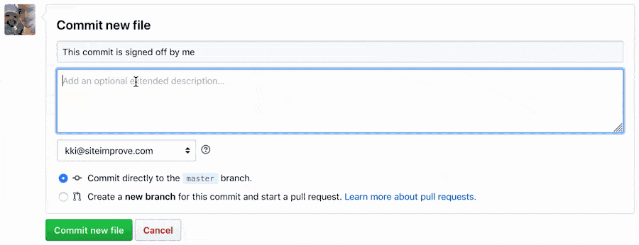

# Contribution guidelines

> :warning: These contribution guidelines only apply to external contributors. Members of the Alfa development team are instead expected to follow the development process as outlined in the [process documentation](PROCESS.md).

## Reporting issues

Prior to opening a new issue, please make sure to [search for existing issues][].

## Contributing code

Alfa currently accepts code contributions in the form of bug fixes. When submitting a pull request fixing a bug, please make sure to indicate using an [issue reference](https://help.github.com/articles/autolinked-references-and-urls/#issues-and-pull-requests) if your pull request fixes an open issue. If you are unsure if your pull request relates to an open issue, please make sure to [search for existing issues][] prior to submitting your pull request.

### Legalese

To ensure that you have the rights to submit your contribution under the license under which Alfa is released, we ask that you certify to the [Developer Certificate of Origin](https://developercertificate.org/) by [signing off](https://git-scm.com/docs/git-commit#git-commit---signoff) on your commits:

> #### Developer's Certificate of Origin 1.1
>
> By making a contribution to this project, I certify that:
>
> (a) The contribution was created in whole or in part by me and I have the right to submit it under the open source license indicated in the file; or
>
> (b) The contribution is based upon previous work that, to the best of my knowledge, is covered under an appropriate open source license and I have the right under that license to submit that work with modifications, whether created in whole or in part by me, under the same open source license (unless I am permitted to submit under a different license), as indicated in the file; or
>
> (c) The contribution was provided directly to me by some other person who certified (a), (b) or (c) and I have not modified it.
>
> (d) I understand and agree that this project and the contribution are public and that a record of the contribution (including all personal information I submit with it, including my sign-off) is maintained indefinitely and may be redistributed consistent with this project or the open source license(s) involved.

#### Signing off on commits

A sign-off is made by including a message in the following format in the comment of each commit that is part of your contribution:

```
Signed-off-by: John Doe <john.doe@example.com>
```

If you are committing changes from the GitHub UI, you can add a sign-off message by adding it as an extended description to your commit:



To automatically sign-off on commits when using git via CLI, pass the `--signoff` flag to git when commiting:

```console
$ git commit --signoff --message "This commit is signed off by me"
```

If you forget to sign-off on a commit, the `--signoff` can also be used in conjunction with the `--amend` flag:

```console
$ git commit --signoff --amend
```

While the `--amend` flag can be used to ammend your last commit with a sign-off, you may have forgotten to sign-off on a whole series of commits. If so, `--signoff` can also be during a rebase to sign-off on more than just the latest commit:

```console
$ git rebase --signoff --interactive
```

[search for existing issues]: https://github.com/Siteimprove/alfa/search?type=Issues
